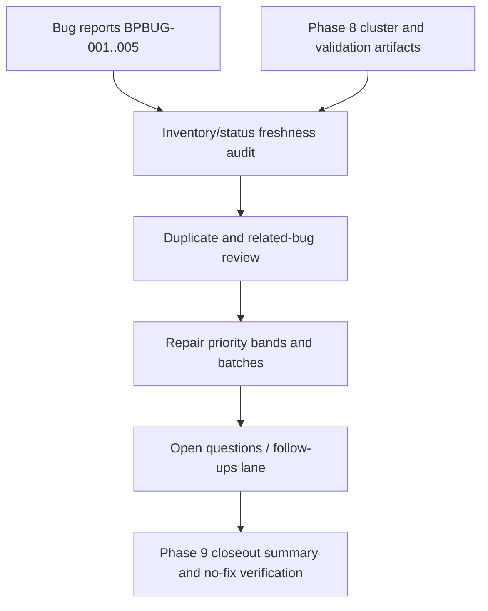

# Phase 9: Bug Index Priority Review - Research

**Researched:** 2026-05-02
**Domain:** defect inventory triage, duplicate policy, repair-batch planning
**Confidence:** HIGH

## User Constraints

### Priority Rubric
- **D-01:** Preserve `severity` and `confidence` as descriptive defect metadata, but add a separate repair-priority lens for Phase 9 outputs. Repair priority should be driven by current impact, blast radius, and repair leverage, not by severity alone.
- **D-02:** Separate active repair candidates from already repaired or verification-only defects before ranking. Inventory history and active repair ordering are different views and should not be merged.
- **D-03:** Break ties between similarly severe bugs by cross-cutting safety leverage or recurrence risk before considering effort or discovery order.
- **D-04:** Present repair priority in three bands: `Now`, `Next`, and `Later`, rather than only a flat numeric list.

### Duplicate Vs Related Policy
- **D-05:** Mark a finding as a duplicate only when it describes the same user-visible defect and would be resolved by the same repair change. Shared root cause alone is not enough.
- **D-06:** Keep distinct but related bugs separate when they have different affected surfaces, evidence, or repair paths. Connect them through `Related Bugs` links and root-cause clusters instead of collapsing them.
- **D-07:** When duplicates are found, the earliest or most complete evidence-backed report becomes the canonical bug. Duplicate entries should keep explicit back-links to that canonical report.
- **D-08:** Duplicate status must be explicit in both the index and the bug document trail; cluster membership must not be used as an implicit duplicate marker.

### Repair-Batch Presentation
- **D-09:** Summarize Phase 9 repair work as batches first, with ordered bugs inside each batch, rather than only as a flat per-bug list.
- **D-10:** Define each batch by shared repair direction and validation surface, not by discovery phase alone.
- **D-11:** Use the current inventory to seed three summary lanes: active runtime and safety fixes, contract and test hardening, and docs synchronization cleanup.
- **D-12:** Keep repaired or verification-only items visible in the inventory, but separate them from active candidates in the repair summary so closed work does not distort the next repair plan.

### Open Questions Lane
- **D-13:** Keep unresolved verification questions in a separate `Verification Questions / Follow-Ups` lane outside the main confirmed bug table.
- **D-14:** Only put evidence gaps, verification follow-ups, or low-confidence leads in that lane. Confirmed defects stay in the bug table, and feature ideas stay out of scope.
- **D-15:** Open questions should affect repair ordering only when they could materially change bug scope or urgency. Otherwise they remain tracked context, not blockers.
- **D-16:** If Blueprint later mirrors this inventory into GitHub Issues or Projects, preserve the same split: confirmed defects as issues, open questions as a separate tracking thread, discussion, or non-bug section rather than duplicate bug rows.

### the agent's Discretion
- The researcher and planner may choose the exact markdown table shapes for the Phase 9 outputs, but they must preserve separate fields or sections for repair priority, duplicate status, related-bug clustering, and open questions.
- The planner may rename the three suggested repair lanes if a better label set fits the final inventory, but the grouping must still reflect shared repair direction and validation surface.
- The planner may refine the active-candidate ordering after re-reading the bug reports, especially if one report's status has changed since discovery. For example, BPBUG-004 should be checked for current status freshness before it is ranked beside unresolved bugs.

### Deferred Ideas
- If Blueprint later migrates this markdown inventory into GitHub Issues or Projects, preserve the same confirmed-defect versus open-question split instead of flattening both into one queue.

## Summary

Phase 9 is a documentation and planning-artifact phase, not a runtime repair phase. The planner should treat `docs/bugs/INDEX.md` as the durable inventory board and BPBUG-001 through BPBUG-005 as the source evidence. [VERIFIED: `docs/bugs/INDEX.md`, `docs/bugs/BPBUG-*.md`] The main planning challenge is not finding new defects; it is preserving the evidence trail while adding the missing repair-planning views: current status, duplicate status, related-bug clusters, repair-priority bands, repair batches, and a separate verification-question lane.

The external process references align with the locked decisions. Atlassian's triage guidance frames prioritization around severity, impact, and release/project urgency rather than severity alone. [CITED: https://www.atlassian.com/agile/software-development/bug-triage] Azure Boards distinguishes priority from severity and treats priority as an impact-to-project ordering field. [CITED: https://learn.microsoft.com/en-us/azure/devops/boards/backlogs/manage-bugs?view=azure-devops] GitHub marks duplicates explicitly and supports structured fields and milestones for grouped, ordered work. [CITED: https://docs.github.com/en/issues/tracking-your-work-with-issues/administering-issues/marking-issues-or-pull-requests-as-a-duplicate] [CITED: https://docs.github.com/en/issues/planning-and-tracking-with-projects/understanding-fields/about-issue-fields] [CITED: https://docs.github.com/en/enterprise-cloud@latest/issues/using-labels-and-milestones-to-track-work/about-milestones]

**Primary recommendation:** Plan Phase 9 as a four-step sequential documentation workflow: inventory/status freshness, duplicate and related-link review, repair-priority batch summary, then closeout/no-fix verification.

## Architectural Responsibility Map

| Capability | Primary Tier | Secondary Tier | Rationale |
|------------|--------------|----------------|-----------|
| Bug inventory metadata | Documentation artifacts | Planning bookkeeping | `docs/bugs/INDEX.md` is the canonical human-readable inventory; `.planning/` records workflow execution only. |
| Duplicate and related-bug policy | Documentation artifacts | Bug report frontmatter | Duplicate status must be explicit in the index and affected bug docs, while root-cause clusters remain a relatedness view. |
| Repair priority and batches | Documentation artifacts | Phase 9 summary | The repair queue is a planning view over existing defects, not a source-code or runtime state change. |
| Open verification questions | Documentation artifacts | Phase summary | Evidence gaps and low-confidence follow-ups should not inflate the confirmed bug table. |
| No-fix boundary proof | Planning bookkeeping | Git status | Phase 9 can edit `.planning/` and `docs/bugs/`; it must not alter source, generated assets, runtime `.blueprint/`, host-global state, or git history. |

## Project Constraints (from AGENTS.md)

- Treat Blueprint as a Gemini-native extension, not as GSD internals or a legacy slash-command port. [VERIFIED: `AGENTS.md`]
- Runtime state is `.blueprint/`; `.planning/` is local bookkeeping only. [VERIFIED: `AGENTS.md`]
- Current milestone is discovery-only: bug docs and planning artifacts may change, but source/runtime defects must not be fixed in this phase. [VERIFIED: `AGENTS.md`]
- `/blu`, `/blu-help`, `/blu-progress`, and `/blu-next` must preserve implemented-only recommendations. [VERIFIED: `AGENTS.md`]
- Do not mutate installed extension directories or host-global `~/.gemini/blueprint/` state. [VERIFIED: `AGENTS.md`]
- Plan-phase must not create, rename, or switch git branches. [VERIFIED: plan-phase workflow]

## Standard Stack

### Core

| Artifact | Version Or Shape | Purpose | Why Standard |
|----------|------------------|---------|--------------|
| `docs/bugs/INDEX.md` | Markdown table plus inventory sections | Canonical defect inventory and repair-planning board | Existing milestone harness already uses it for bug rows, vocabulary, clusters, slice coverage, and routing guardrails. |
| `docs/bugs/BPBUG-###-*.md` | Template-backed Markdown reports | Per-defect evidence and repair direction | Preserves exact evidence, uncertainty, related bugs, and no-fix history. |
| `.planning/phases/09-bug-index-priority-review/*-SUMMARY.md` | GSD execution summaries | Records what Phase 9 execution changed and verified | Keeps workflow bookkeeping separate from Blueprint runtime state. |
| `rg` and `git status --short` | CLI checks | Fast inventory and no-fix verification | Existing plans rely on grep/status checks as auditable, low-risk evidence. |

### Supporting

| Reference | Purpose | When to Use |
|-----------|---------|-------------|
| `.planning/quick/260502-bpbug-004-dist-refresh/260502-bpbug-004-dist-refresh-SUMMARY.md` | Current repair evidence for BPBUG-004 | Required before assigning BPBUG-004 to active repair priority. |
| `.planning/phases/07-host-packaging-build-hooks-audit/07-VALIDATION.md` | Validation evidence after BPBUG-004 repair | Required for status freshness and active-vs-repaired split. |
| `.planning/phases/08-cross-cut-drift-and-regression-gaps/08-*.md` | Drift, regression, concern, and cluster evidence | Required to preserve root-cause links and deferred non-bug notes. |

### Alternatives Considered

| Instead Of | Could Use | Tradeoff |
------------|-----------|----------|
| Extending `docs/bugs/INDEX.md` | Create only a separate Phase 9 priority report | A separate report is useful as execution evidence, but the canonical index would still lack the repair-planning view required by REPAIR-01. |
| Three priority bands | Exact numeric scoring | Numeric scoring would look more precise than the evidence supports for a five-bug inventory. |
| Explicit duplicate status | Cluster membership only | Cluster membership captures shared causes, but it does not remove duplicate work or name a canonical report. |

## Architecture Patterns

### System Flow



### Pattern 1: Inventory Views Are Additive

**What:** Keep the existing bug table as the canonical report list, then add separate sections for active repair candidates, repaired/history items, duplicate status, related clusters, and verification questions.

**When to use:** Whenever a bug inventory must serve both as evidence history and as input to later repair planning.

**Evidence:** The current index already separates bug rows, vocabulary, root-cause clusters, illustrative examples, guardrails, and slice coverage. [VERIFIED: `docs/bugs/INDEX.md`]

### Pattern 2: Status Freshness Before Priority

**What:** Re-read current validation and quick-task evidence before ranking a bug. BPBUG-004 is the specific test case because the report still says `status: new`, while later evidence says the generated `dist` repair and targeted validation passed.

**When to use:** Before assigning `Now`, `Next`, or `Later` to any bug.

### Pattern 3: Duplicate Threshold Requires Same Defect And Same Repair Path

**What:** Shared root cause is not enough. Duplicates should be marked only when the canonical report and duplicate report describe the same user-visible defect and the same fix would resolve both.

**When to use:** During duplicate review and related-bug link cleanup.

## Don't Hand-Roll

| Problem | Don't Build | Use Instead | Why |
|---------|-------------|-------------|-----|
| New issue tracker model | A custom schema unrelated to existing bug docs | Existing `docs/bugs/TEMPLATE.md` vocabulary plus additive index sections | The milestone already has stable bug ids, severity, confidence, surface, status, and no-fix language. |
| Precise scoring algorithm | Numeric score that pretends certainty | Three priority bands plus rationale | The current inventory is small and evidence-backed; bands are clearer and safer. |
| Duplicate inference | Root-cause-only duplicate collapse | Explicit duplicate status with canonical back-link | GitHub-style duplicate handling is explicit and auditable. |

## Common Pitfalls

### Pitfall 1: Treating BPBUG-004 As Active Without Freshness Check

**What goes wrong:** BPBUG-004 remains ranked beside unresolved defects even though a later quick repair and Phase 7 validation rerun show the tracked `dist` asset issue was repaired.

**How to avoid:** Read `260502-bpbug-004-dist-refresh-SUMMARY.md` and `07-VALIDATION.md`; update the inventory to separate repaired/history from active candidates.

### Pitfall 2: Collapsing Related Bugs Into Duplicates

**What goes wrong:** Shared cluster labels hide distinct surfaces and repair paths, reducing the usefulness of later repair planning.

**How to avoid:** Apply D-05 through D-08 and keep BPBUG-001, BPBUG-002, BPBUG-003, and BPBUG-005 distinct unless a same-defect/same-fix duplicate is found.

### Pitfall 3: Mixing Open Questions With Confirmed Bugs

**What goes wrong:** Evidence gaps or low-confidence leads inflate the confirmed defect count and make the repair queue feel noisier than it is.

**How to avoid:** Use a separate `Verification Questions / Follow-Ups` section and keep confirmed defects in the main table.

### Pitfall 4: Planning Artifacts Masquerade As Runtime State

**What goes wrong:** `.planning/` closeout changes are treated as Blueprint runtime state, or execution touches `.blueprint/` while doing inventory work.

**How to avoid:** Keep writes limited to `docs/bugs/`, `.planning/phases/09-*`, `.planning/ROADMAP.md`, and `.planning/STATE.md`.

## Code Examples

No production code examples are needed. The execution plans should use concrete CLI verification commands instead:

```bash
rg -n "BPBUG-00[1-9]|status:|severity:|confidence:|surface:" docs/bugs/INDEX.md docs/bugs/BPBUG-*.md
rg -n "Root Cause Clusters|Duplicate|Repair Priority|Verification Questions" docs/bugs/INDEX.md
git status --short
```

## State Of The Art

| Old Approach | Current Approach | Source | Impact |
|--------------|------------------|--------|--------|
| Severity-only ordering | Severity plus impact, urgency, and project context | Atlassian and Azure docs | Supports D-01 through D-04. |
| Informal duplicate prose | Explicit duplicate marker and canonical reference | GitHub duplicate docs | Supports D-05 through D-08. |
| Flat issue list only | Structured fields, groups, and milestones | GitHub Projects and milestones docs | Supports repair batches and priority bands. |

## Assumptions Log

| # | Claim | Section | Risk If Wrong |
|---|-------|---------|---------------|
| A1 | Phase 9 should not create new bug reports unless execution uncovers an actual inventory defect. | Summary | Low; if execution finds an inventory/documentation defect, the existing bug template still applies. |

## Open Questions (RESOLVED)

1. **Should BPBUG-004 be ranked as active?**
   - RESOLVED: No. Plans must require a current-status check and separate repaired/history items from active repair candidates.
2. **Should Phase 9 use GitHub Issues or Projects directly?**
   - RESOLVED: No. The migration idea is deferred; Phase 9 should preserve the markdown inventory and only describe how it could map later.
3. **Can duplicate status be inferred from root-cause clusters?**
   - RESOLVED: No. D-08 requires explicit duplicate status in the index and bug trail.

## Validation Architecture

### Test Framework

| Property | Value |
|----------|-------|
| Framework | Node test runner via `tsx --test`; grep/status checks for documentation artifacts |
| Config file | `package.json`, `tsconfig.json` |
| Quick run command | `rg -n "BPBUG-00[1-9]|Repair Priority|Repair Batches|Verification Questions|Duplicate" docs/bugs/INDEX.md docs/bugs/BPBUG-*.md` |
| Full suite command | `npm test` |

### Phase Requirements To Test Map

| Req ID | Behavior | Test Type | Automated Command | File Exists? |
|--------|----------|-----------|-------------------|--------------|
| BUG-04 | Duplicate or related findings are explicit and cross-linked. | grep/status | `rg -n "Duplicate And Related Findings|Root Cause Clusters|Related Bugs|duplicate" docs/bugs/INDEX.md docs/bugs/BPBUG-*.md` | yes |
| REPAIR-01 | Highest-priority repair candidates are summarized. | grep/status | `rg -n "Repair Priority|Now|Next|Later|Repair Batches" docs/bugs/INDEX.md .planning/phases/09-bug-index-priority-review/*-SUMMARY.md` | yes |
| REPAIR-02 | Each bug remains repair-ready with evidence and fix direction. | grep/status | `rg -n "## Evidence|## Verification Steps|## Suggested Fix Direction|## Uncertainty" docs/bugs/BPBUG-00[1-9]-*.md` | yes |
| REPAIR-03 | Open verification questions are separated from confirmed defects. | grep/status | `rg -n "Verification Questions|Follow-Ups|open question|evidence gap" docs/bugs/INDEX.md .planning/phases/09-bug-index-priority-review/*-SUMMARY.md` | yes |
| NFIX-01, NFIX-02, NFIX-03 | Phase 9 writes stay limited to planning artifacts and bug docs. | status audit | `git status --short` | yes |

### Sampling Rate

- Per task: run the targeted grep/status command listed in the plan.
- Per wave: run the Phase 9 quick run command and inspect `git status --short`.
- Phase gate: run the closeout verification commands in `09-04-PLAN.md`.

### Wave 0 Gaps

None. Existing markdown artifacts and grep/status checks cover all Phase 9 requirements.

## Security Domain

### Applicable Controls

| Category | Applies | Standard Control |
|----------|---------|------------------|
| Input validation | yes | Do not invent bug rows; derive rows from existing BPBUG files and exact frontmatter. |
| Access control | no | Phase 9 does not modify access-controlled runtime behavior. |
| Secure state handling | yes | Do not mutate `.blueprint/`, installed extensions, host-global state, branches, remotes, or git history. |
| Auditability | yes | Record `git status --short`, exact grep evidence, and status-freshness sources in summaries. |

### Known Threat Patterns

| Pattern | Risk | Mitigation |
|---------|------|------------|
| Documentation status drift | The repair queue can mislead later planners. | Require BPBUG-004 freshness check and index/report status reconciliation. |
| Duplicate over-collapse | Distinct defects can lose repair-ready evidence. | Apply D-05 and preserve separate reports unless same defect and same repair path. |
| Scope creep into repairs | Phase 9 could become a fix phase. | Restrict writes to `.planning/` and `docs/bugs/`; record no-fix boundary. |

## Sources

### Primary (HIGH confidence)

- `docs/bugs/INDEX.md` - current bug table, vocabulary, clusters, and slice coverage.
- `docs/bugs/BPBUG-001-ship-undo-report-contracts-underconstrained.md` through `docs/bugs/BPBUG-005-repo-root-guard-accepts-any-git-entry.md` - current real bug reports.
- `.planning/phases/09-bug-index-priority-review/09-CONTEXT.md` - locked Phase 9 decisions.
- `.planning/quick/260502-bpbug-004-dist-refresh/260502-bpbug-004-dist-refresh-SUMMARY.md` and `.planning/phases/07-host-packaging-build-hooks-audit/07-VALIDATION.md` - BPBUG-004 status freshness.
- Atlassian bug triage guide - https://www.atlassian.com/agile/software-development/bug-triage
- Microsoft Learn Azure Boards bug management - https://learn.microsoft.com/en-us/azure/devops/boards/backlogs/manage-bugs?view=azure-devops
- GitHub duplicate issue docs - https://docs.github.com/en/issues/tracking-your-work-with-issues/administering-issues/marking-issues-or-pull-requests-as-a-duplicate
- GitHub Issues overview - https://docs.github.com/en/issues/tracking-your-work-with-issues/learning-about-issues/about-issues
- GitHub issue fields docs - https://docs.github.com/en/issues/planning-and-tracking-with-projects/understanding-fields/about-issue-fields
- GitHub milestones docs - https://docs.github.com/en/enterprise-cloud@latest/issues/using-labels-and-milestones-to-track-work/about-milestones

### Secondary (MEDIUM confidence)

- `.planning/phases/08-cross-cut-drift-and-regression-gaps/08-DRIFT-MATRIX.md`
- `.planning/phases/08-cross-cut-drift-and-regression-gaps/08-REGRESSION-GAPS.md`
- `.planning/phases/08-cross-cut-drift-and-regression-gaps/08-CONCERN-TRIAGE.md`

### Tertiary (LOW confidence)

- None.

## Metadata

**Confidence breakdown:**
- Inventory state: HIGH - verified against local bug docs and Phase 8/quick-task artifacts.
- Triage process: HIGH - verified against current Atlassian, Microsoft, and GitHub docs.
- Execution shape: HIGH - follows existing Phase 5 through Phase 8 closeout patterns.

**Research date:** 2026-05-02
**Valid until:** 2026-06-01 for process guidance; re-check local bug status before execution.
