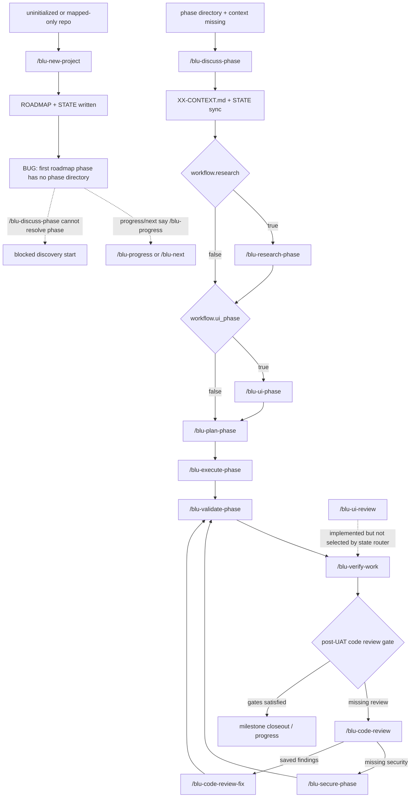

# Focused State And Next-Step Workflow Defect Review

Date: 2026-05-08

## Method

This was a discovery-only review of state management and next-step management for `/blu-progress`, `/blu-new-project`, `/blu-discuss-phase`, `/blu-research-phase`, `/blu-ui-phase`, `/blu-plan-phase`, `/blu-execute-phase` as the current runtime equivalent of the older implement-phase naming, `/blu-code-review`, `/blu-code-review-fix`, `/blu-secure-phase`, `/blu-ui-review`, `/blu-validate-phase`, and `/blu-verify-work`.

Inspected runtime truth came from:

- `commands/*.toml` for the scoped commands.
- `skills/**/SKILL.md` and scoped `skills/**/references/*.md`.
- `src/mcp/tools/project.ts`, `src/mcp/tools/state.ts`, `src/mcp/tools/phase.ts`, `src/mcp/tools/review.ts`, `src/mcp/tools/quality-gates.ts`, `src/mcp/tools/artifacts.ts`.
- `src/mcp/command-runtime-metadata.ts`, `src/mcp/command-resources.ts`, and artifact contracts under `src/mcp/artifact-contracts/`.
- Focused regression tests under `tests/`, especially `new-project.test.ts`, `help-progress-health.test.ts`, `phase-discovery-*.test.ts`, `quality-gate-routing.test.ts`, `validate-phase-tools.test.ts`, `verify-work-roadmap-sync.test.ts`, and review/security/UI-review slice tests.

Intentionally ignored:

- Existing `docs/bugs/**` reports.
- Installed extension directories and host-global `~/.gemini/blueprint/` state.
- Docs as runtime truth. `docs/commands/*.md` were read only to compare declared next-command guidance against manifests and runtime wiring.

## Workflow State Machine



## Finding 1: New Project Writes Roadmap Phases That Phase Discovery Cannot Resolve

Severity: High

Affected commands: `/blu-new-project`, `/blu-progress`, `/blu-next`, `/blu-discuss-phase`

Expected behavior:

After a successful greenfield or mapped bootstrap, the next central workflow step should either be runnable directly or the state router should explain the missing substrate and name a repair action. A roadmap phase created by `/blu-new-project` should be resolvable by phase discovery, or `/blu-progress` / `/blu-next` should not imply that the repo is simply ready for generic progress review.

Actual behavior:

`blueprint_project_init` writes `.blueprint/ROADMAP.md`, `.blueprint/STATE.md`, and only the `.blueprint/phases/` root. It does not create a directory for the first roadmap phase. `blueprint_phase_locate` then refuses to resolve Phase 1 because the matching phase directory is missing. Meanwhile `blueprint_project_init`, `blueprint_project_status`, and `blueprint_state_load.derivedStatus.nextAction` all report `/blu-progress`, not a concrete discovery or repair route.

Evidence:

- `src/mcp/tools/project.ts:1195-1205` calls `blueprintArtifactScaffold` with `.blueprint/PROJECT.md`, `.blueprint/REQUIREMENTS.md`, `.blueprint/ROADMAP.md`, and `.blueprint/phases/` only.
- `src/mcp/tools/project.ts:1211-1225` seeds `STATE.md` with `currentPhase` but `nextAction: Run /blu-progress to review the next safe Blueprint action`.
- `src/mcp/tools/project.ts:1246-1249` returns the same `/blu-progress` action on success.
- `src/mcp/tools/phase.ts:9780-9801` makes `blueprint_phase_locate` return `found: false` when the roadmap phase has no matching directory.
- A focused runtime probe in a temporary git repo produced:

```json
{
  "initNextAction": "Run /blu-progress to review the next safe Blueprint action",
  "statusNextAction": "Run /blu-progress to review the next safe Blueprint action",
  "stateNextAction": "Run /blu-progress to review the next safe Blueprint action",
  "locateFound": false,
  "locateReason": "Phase 1 exists in .blueprint/ROADMAP.md but has no matching directory in .blueprint/phases/.",
  "createdPaths": [
    ".blueprint/PROJECT.md",
    ".blueprint/REQUIREMENTS.md",
    ".blueprint/ROADMAP.md",
    ".blueprint/phases/",
    ".blueprint/STATE.md",
    ".blueprint/config.json"
  ]
}
```

State/next-step impact:

The central workflow can dead-end immediately after bootstrap. `/blu-discuss-phase 1` cannot resolve the phase, but `/blu-progress` and `/blu-next` do not identify the missing phase directory as the actionable blocker. The stored state claims a current phase exists without the phase tree needed by downstream commands.

Uncertainty:

Low. The runtime probe exercised the exported MCP handlers directly, and the code path is deterministic. The only product-policy uncertainty is whether bootstrap should create the first phase directory or route to a dedicated repair/scaffold command.

Suggested fix direction:

Pick one canonical bootstrap handoff and encode it in MCP, manifests, and tests:

- Either have `/blu-new-project` create the first phase directory and starter `XX-CONTEXT.md` scaffold using the same phase-directory rules as roadmap-admin commands, then route to `/blu-discuss-phase <phase>`.
- Or keep bootstrap doc-only but make `project_status` / `state_load` surface a precise repair route for the missing phase directory instead of generic `/blu-progress`.

## Finding 2: `/blu-ui-phase` Cannot Prove Its Final Next Action Comes From Refreshed MCP State

Severity: Medium

Affected command: `/blu-ui-phase`

Expected behavior:

After writing or reusing `XX-UI-SPEC.md`, `/blu-ui-phase` should refresh state and report the next safe implemented command from MCP-owned state, matching the discovery pattern used by `/blu-discuss-phase` and `/blu-research-phase`.

Actual behavior:

The command and runtime metadata require `blueprint_state_update`, but they omit `blueprint_state_load` and `blueprint_command_catalog`. The manifest says to call state update "to set the next safe action", but it does not require `base: "synced"` or a post-update state load. The detailed UI-phase runtime contract simultaneously says the saved path and next action came from MCP-owned state, creating a contract mismatch.

Evidence:

- `commands/blu-ui-phase.toml:39-40` says to call `mcp_blueprint_blueprint_state_update` and return the next safe action.
- `commands/blu-ui-phase.toml:43-49` allowlists only phase locate/status/config/artifact tools plus `mcp_blueprint_blueprint_state_update`; it does not allow `mcp_blueprint_blueprint_state_load` or `mcp_blueprint_blueprint_command_catalog`.
- `src/mcp/command-runtime-metadata.ts:264-273` defines `UI_PHASE_REQUIRED_TOOLS` without `blueprint_state_load`.
- `skills/blueprint-phase-discovery/SKILL.md:118-127` mirrors that `/blu-ui-phase` tool list and omits `blueprint_state_load`.
- `skills/blueprint-phase-discovery/references/ui-phase-runtime-contract.md:148-149` says the saved path and next action came from MCP-owned state and implemented command routing.
- `tests/phase-discovery-ui.test.ts:90-99` locks the current required-tool set and likewise omits `blueprint_state_load`, while the subagent test review found no direct `STATE.md` / `derivedStatus.nextAction` regression for `/blu-ui-phase`.

State/next-step impact:

The command can plausibly write `STATE.md` with a prompt-chosen next action, but it lacks the same final readback used by nearby discovery commands to catch stale routing, config-gated prerequisites, or implemented-only drift. This is especially important because `ui-phase` is optional/config-gated and sits immediately before `/blu-plan-phase`.

Uncertainty:

Medium. A careful model could explicitly patch `nextAction: "/blu-plan-phase <phase>"` after a successful UI-spec write, and `/blu-plan-phase` is implemented today. The defect is the contract mismatch and missing verification read, not a proven bad write from one captured command run.

Suggested fix direction:

Align `/blu-ui-phase` with `/blu-discuss-phase` and `/blu-research-phase`: include `blueprint_state_load` and, if dynamic implemented-only checking is required, `blueprint_command_catalog`; require `blueprint_state_update` with `base: "synced"` plus `patch.currentPhase` / `patch.activeCommand`; then report `derivedStatus.nextAction` from the reload. Add a state-transition regression test for UI-phase.

## Finding 3: `/blu-ui-review` Is Implemented But Is Never Surfaced By Runtime State Routing

Severity: Medium

Affected commands: `/blu-progress`, `/blu-next`, `/blu-verify-work`, `/blu-ui-review`

Expected behavior:

If `/blu-ui-review` is a shipped advisory quality phase, the workflow router should either surface it at the appropriate time for phases with UI work, or the product contract should explicitly say that UI review is manual-only and not part of progress/next recommendations.

Actual behavior:

The command is implemented and root-routable, but the state router only knows the post-UAT code-review/security quality gate. There is no state-machine branch that emits `/blu-ui-review`, and progress/verify docs describe post-UAT routing only through `/blu-code-review` and `/blu-secure-phase`.

Evidence:

- `src/mcp/command-runtime-metadata.ts:1955-1965` declares `ui-review` implemented and root-routable.
- `src/mcp/command-runtime-metadata.ts:1973-1978` says `ui-review` audits shipped UI work and writes `phase XX-UI-REVIEW.md`.
- `src/mcp/tools/state.ts:1794-1997` derives the lifecycle route through context, research, UI-spec, plan, execute, validation, UAT, and quality gates, but only consults `qualityGateNextAction`.
- `src/mcp/tools/quality-gates.ts:1006-1044` can emit `/blu-code-review`, `/blu-secure-phase`, or a saved review next action; it has no UI-review branch.
- `docs/commands/progress.md:36` mentions only the post-UAT quality gate.
- `docs/commands/progress.md:100` orders no review -> `/blu-code-review`, no security -> `/blu-secure-phase`, open findings -> saved review next safe action, gates complete -> normal advancement.
- `docs/commands/verify-work.md:120` has the same post-UAT chain and no UI-review route.
- `tests/ui-review-slice.test.ts:316-380` verifies `ui-review` is implemented and has a rich artifact contract, but the routing tests in `tests/quality-gate-routing.test.ts:718-1082` cover only code-review/security gates.

State/next-step impact:

Frontend phases can proceed through UAT and code/security gates without `/blu-progress` or `/blu-next` ever suggesting the dedicated UI audit. That can silently drop a shipped review surface unless the user already knows to invoke `/blu-ui-review`.

Uncertainty:

Medium. This may be intentional if `ui-review` is a manual or opt-in quality command. The ambiguity is not documented in the runtime router contract, and the command is included in the central workflow review scope.

Suggested fix direction:

Decide and encode policy. If UI review should be advisory, add state evidence for when a phase has UI surface or `XX-UI-SPEC.md`, then surface `/blu-ui-review <phase>` at the chosen point. If it is manual-only, document that in progress/next, verify-work, and ui-review contracts so the absence from state routing is intentional.

## Finding 4: Command Specs And Manifests Drift On Several Next-Step Details

Severity: Low

Affected commands: `/blu-progress`, `/blu-code-review-fix`, `/blu-ui-review`, `/blu-new-project`

Expected behavior:

Command specs can be richer than manifests, but next-command guidance should not diverge enough that maintainers cannot tell which sequence the runtime actually intends.

Actual behavior:

The reviewed docs and manifests mostly align, but several next-step details are one-sided or imprecise:

- `docs/commands/progress.md` spells out the post-UAT review/security chain, while `commands/blu-progress.toml` only says to use state-derived implemented commands.
- `commands/blu-code-review-fix.toml` spells out final branching to `/blu-validate-phase`, `/blu-add-tests`, or `/blu-progress`; `docs/commands/code-review-fix.md` keeps this more generic.
- `commands/blu-ui-review.toml` spells out missing verification -> `/blu-validate-phase`, missing UAT -> `/blu-verify-work`, otherwise `/blu-progress`; `docs/commands/ui-review.md` keeps that hierarchy implicit.
- `docs/commands/new-project.md` has one prose shorthand `map-codebase` without `/blu-`, although the manifest and routing sections use `/blu-map-codebase`.

Evidence:

- `commands/blu-progress.toml:11-26` reads runtime status/state/artifacts/catalog and reports state-derived guidance.
- `docs/commands/progress.md:96-103` explicitly defines the post-UAT chain.
- `commands/blu-code-review-fix.toml:36-37` defines the validate/add-tests/progress branching after remediation.
- `commands/blu-ui-review.toml:28-32` defines the validation/UAT/progress hierarchy after UI review.
- `docs/commands/new-project.md:46` uses `map-codebase` shorthand; `commands/blu-new-project.toml:27-29` uses `/blu-map-codebase`.

State/next-step impact:

This is not a direct runtime failure because the source-owned manifests and MCP state code are the active runtime inputs. It does increase repair risk: future command edits could copy the less-specific doc text and lose a currently intended branch.

Uncertainty:

Low for the drift, medium for product impact. Most examples are omissions rather than contradictions.

Suggested fix direction:

Either keep docs explicitly subordinate to runtime-owned metadata and accept the omissions, or update docs/specs to mirror the manifest-level next-action hierarchy for these commands. Normalize all direct command references to `/blu-*` form.

## Areas Reviewed With No Confirmed Bug

- Implemented-only routing: `/blu-progress` and `/blu-next` both read the command catalog before recommending commands (`commands/blu-progress.toml:15`, `commands/blu-next.toml:12,24`), and `tests/next.test.ts` plus `tests/help-progress-health.test.ts` cover read-only router behavior.
- `/blu-discuss-phase` and `/blu-research-phase` state advancement: both require synced `STATE.md` updates and post-update `state_load` routing (`commands/blu-discuss-phase.toml:19-20`, `commands/blu-research-phase.toml:19-20`; `tests/phase-discovery-discuss.test.ts:661-663`, `tests/phase-discovery-research.test.ts` state routing coverage).
- `/blu-plan-phase` and `/blu-execute-phase` lifecycle handoff: planning gates on research readiness and syncs state after plan persistence (`commands/blu-plan-phase.toml:26,40`), while execution routes missing plans back to planning and hands off to validation before completion claims (`commands/blu-execute-phase.toml:16,21-22`).
- Validation/UAT repair routing: `/blu-validate-phase` keeps validation active until verification is UAT-ready or an implemented repair route is saved (`commands/blu-validate-phase.toml:16,29-40`), and `/blu-verify-work` keeps checkpointed UAT on `/blu-verify-work <phase>` (`commands/blu-verify-work.toml:28`). `tests/validate-phase-tools.test.ts` and `tests/verify-work-roadmap-sync.test.ts` exercise these paths.
- Code review/security gates after UAT: `tests/quality-gate-routing.test.ts:718-1082` covers missing review -> `/blu-code-review`, missing security -> `/blu-secure-phase`, saved review-fix debt -> `/blu-code-review-fix`, stale secure-phase next action handling, and no-reviewable-file fallback.
- Review-family artifact persistence: `blueprint_review_record` owns `REVIEW`, `REVIEW-FIX`, `SECURITY`, and `UI-REVIEW` writes (`src/mcp/tools/review.ts:9561`), and the slice tests cover schema-first persistence for code review, security, review-fix, and UI-review.

## Coverage And Residual Risk

This pass reviewed the central workflow from bootstrap through discovery, planning, execution, validation, UAT, and quality review. It used five bounded subagents for manifests/docs, skills, MCP state/artifacts, progress/next routing, and test coverage, then verified the strongest bootstrap suspicion with a direct runtime probe.

Residual risk:

- The report did not run a full end-to-end Gemini command session; it reviewed command manifests and MCP handlers directly.
- Stored `STATE.md` is updated by explicit command orchestration rather than automatically by every artifact writer. That pattern is intentional in the current architecture, but it means command prompt drift can create stale state unless covered by tests.
- UI-phase state-transition coverage is thinner than discuss/research coverage.
- Passing tests should not be treated as proof there are no defects; several findings are contract or routing-surface ambiguities that current tests either encode or do not cover.
